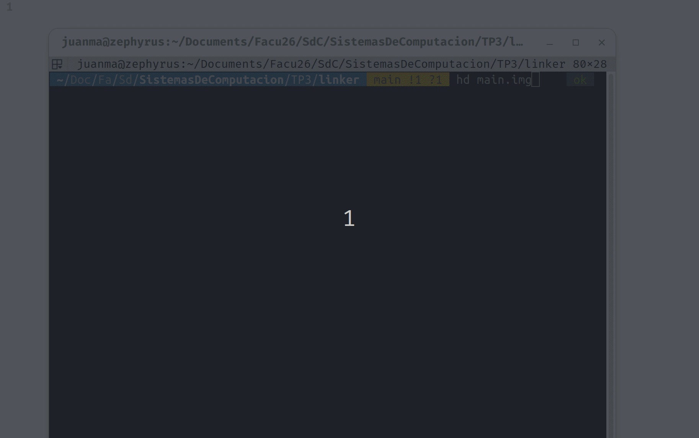
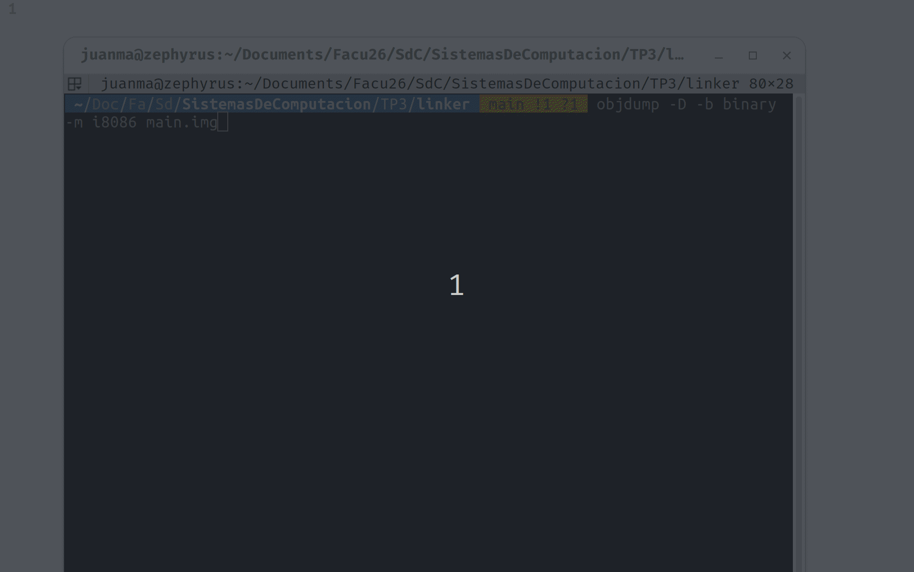
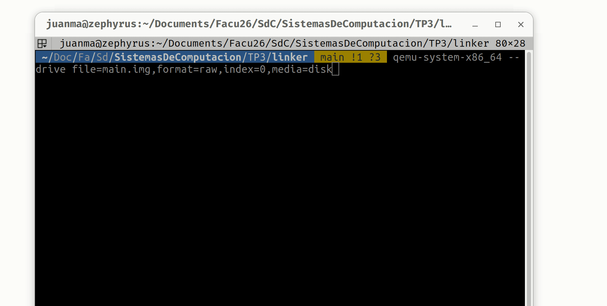

# Sistemas de Computacion
## TP3 - Modo real vs modo protegido


### Creacion de una imagen booteable

Crear imagen booteable simple:
```
printf '\364%509s\125\252' > main.img
```

Correr la imagen en Quemu. Quemu es un emulador y virtualizador de hardware de codigo abierto. Como emulador traduce instrucciones de una arquitectura a otra y como virtualizador, cuando la arquitectura coincide con la del host puede usar aceleracion por hardware.

Instalacion de Quemu:

```
sudo apt install qemu-system-x86
```

El comando:
```
qemu-system-x86_64 --drive file=main.img,format=raw,index=0,media=disk
```
Crea una PC virtual completa y arranca la imagen como lo haria hardware real.

#### Gif con todo el proceso


La maquina donde se realizo esta consigna no cuenta con el modo CSM (Compatibility Support Module), lo que imposibilita poder seguir arrancando cosas legacy/MBR. Por ende el pendrive no aparece entre las opciones de arranque.

### UEFI y Coreboot

### ¿Qué es UEFI? ¿como puedo usarlo? Mencionar además una función a la que podría llamar usando esa dinámica.  
UEFI (Unified Extensible Firmware Interface) es el reemplazo moderno del antiguo BIOS (Basic Input/Output System), que era el sistema de firmware que arrancaba computadoras, desarrolado por Intel. UEFI ofrece una interfaz estandar entre el sistema operativo y el firmware de la maquina. 
A diferencia de la BIOS que era basica y corria en modo real de 16 bits, lo que significaba que tenia accesos a solo 1MiB de memoria, UEFI pasa inmediatamente a modo protegido de 32 o 64 bits con acceso a espacio de memoria de 4GiB en 32 bits y 16EiB en 64, lo que le permite el acceso total a la memoria RAM desde el arranque.
La BIOS permitia hasta 4 particiones primarias y discos de 2TiB mientras que UEFI usa GPT (GUID Partition Table) que soporta hasta 128 particiones y 9.4 ZiB de capacidad de discos.
La UEFI implementa tambien un sistema de verificacion criptografica donde el firmware solo ejecuta bootloaders firmados con claves autorizadas (Secure Boot).
El CSM es un componente adicional que traen algunas EUFI para emular una bios tradicional y poder ejecutar imagenes MBR legacy.

Para poder usar UEFI se debe: crear un programa en c, compilarlo con las librerias UEFI que proporcionan los headers con las definiciones de los protocolos y servicios y generar un ejecutable .efi. Luego se coloca ese archivo en la EFI system partition y el firmware lo encuentra y lo ejecuta al arrancar.

Ejemplos de funciones:
- Boot Services: disponibles solo durante el arranque. Incluyen funciones para gestionar memoria, cargar imágenes ejecutables, manejar eventos y timers, y acceder a protocolos de dispositivos.

### ¿Menciona casos de bugs de UEFI que puedan ser explotados?

- Caso LogoFAIL: un bug que podia ser explotado para entregar un payload malicioso y eludir seguridad como Secure Boot, Intel Boot Guard, entre otras. Ademas, estas vulnerabilidades facilitaban la entrega de malware persistente a sistemas comprometidos durante la fase de arranque , al inyectar un archivo de imagen de logo malicioso en la particion del sistema EFI.

### ¿Qué es Converged Security and Management Engine (CSME), the Intel Management Engine BIOS Extension (Intel MEBx).?

CSME

CSME surge en 2017/2028 como renombre de loq ue era ME (Intel Management Engine) un subsistemadesarrollado en 2006. El CSME es un microcontrolador independiente que se encuentra en el chipset y cuenta con microprocesador propio, tiene su propia ram y corre su propio sistema operativo. Funciona completamente independiente de la CPU principal, funciona siempre que la placa madre tenga tension, incluso cuando el SO esta apagado o la maquina en estado de suspension.
Las principales funciones de CSME son:
- Seguridad del firmware: es el primer codigo que se ejecuta cuando se energiza la placa madre, verifica la integridad criptografica de la UEFI
- Gestion remota: permite encender, apagar, reiniciar, acceder a la consola, redirigir el teclado y el video, o reinstalar el SO de forma remota.
- Boot guard: permite "quemar" en fusibles permanentes un hash del firmware legitimo, de modo que si alguien modifica la BIOS, el sistema no arranca.

Intel MEBx

Es la interfaz de configuracion del CSME durante el arranque del sistema, de manera similar  a como la UEFI/BIOS permite configurar parametros del hardware.
Desde el MEBx se puede:
- Habilitar o deshabilitar AMT
- COnfigurar credenciales de acceso remoto
- Configurar la interfaz de red que se usara para la gestion
- Establecer politicas de acceso
- Activar KVM (Keyboard Video Mouse) remoto por hardware

### ¿Qué es coreboot ? ¿Qué productos lo incorporan ?¿Cuales son las ventajas de su utilización?

Coreboot se diferencia de la BIOS/UEFI, ya que en lugar de ser un firmware monolitico que implementa toda una interfaz de compatibilidad con hardware antiguo, coreboot hace lo minimo indispensable en hardware y delega todo lo demas a un payload separado.
Los productos que lo incorporan son:
- Google chromebooks
- System 76: fabricante de laptops y workstations linux
- Purims: fabricante de laptops orientadas a privacidad
- Qemu: firmware de maquinas virtuales

Las ventajas de Coreboot son:
- Velcidad de arranque: Al no cargar decadas de compatibilidad legacy, coreboot puede inicializar el hardware y entregar control al SO en tiempos dramaticamente menores.
- Transparencia y auditabilidad: Es codigo abierto, cualquiera puede aauditar exactamente que hace el firmware.
- Menor superficie de ataque: Al tener lo minimo la superficie de ataque es menor
- Modularidad: La arquitectura payload permite adaptar el firmware
- Independencia del vendedor: Al no depender del codigo del propietario, se puede actualizar el firmaware de equipos que el fabricante ya no soporta.  


### Linker

### ¿Que es un linker? ¿que hace ? 

El linker es una herramienta que toma uno o mas archivos .o y los combina en un unico archivo. Resuelve referencias, cuando el codigo tiene una etiqueta como msg que aputana  un string , el ensamblador no sabe en que direccion de memoria va a quedar ese string. El linker asigna las direcciones definitivas a cada simbolo y parchea todas las intrucciones que los referencian con la direccion correcta.

### ¿Que es la dirección que aparece en el script del linker?¿Porqué es necesaria ?

La línea . = 0x7c00 establece el el contador de posición del linker en la dirección 0x7C00. Esto le dice al linker que el programa va a estar ubicado en esa dirección de memoria cuando se ejecute. Es necesaria porque la BIOS, al encontrar un MBR válido, siempre lo carga en la dirección 0x7C00 y salta ahí. Si el linker no supiera esto, calcularía las direcciones de las etiquetas (como msg) asumiendo que el programa empieza en 0, y todas las referencias a datos serían incorrectas cuando el código se ejecute realmente en 0x7C00.

### Compare la salida de objdump con hd, verifique donde fue colocado el programa dentro de la imagen. 

Salida con hd:


Salida con objdump:


El programa ejecutable ocupa los primeros 15 bytes de la imagen (posiciones 0x00 a 0x0E). Son las instrucciones mov, lods, or, je, int, jmp y hlt que conforman el loop de impresión. En hd se ven como bytes hexadecimales (be 0f 7c b4 0e ac 08 c0 74 04 cd 10 eb f7 f4), y en objdump se ven como instrucciones desensambladas.

### Grabar la imagen en un pendrive y probarla en una pc y subir una foto 



### ¿Para que se utiliza la opción --oformat binary en el linker?

Le dice al linker que genere un archivo binario plano (raw binary), sin ningún header ni metadata, solo los bytes del código y datos tal cual deben aparecer en memoria.


### Modo protegido

#### Transición a Modo Protegido (Sin macros)
Para pasar de Modo Real (16 bits) a Modo Protegido (32 bits), es necesario deshabilitar las interrupciones, cargar una Tabla Global de Descriptores (GDT) en memoria, cambiar el bit 0 del registro de control `CR0` y hacer un salto largo (*far jump*) para limpiar el pipeline del procesador.

A continuación, se presenta el código Assembler resolviendo las consignas propuestas (espacios de memoria diferenciados y segmento de datos de solo lectura):

```assembly
.code16
.global _start

_start:
    cli                     # 1. Deshabilitar interrupciones
    lgdt gdtr               # 2. Cargar el registro GDT con el puntero a nuestra tabla

    # 3. Habilitar el modo protegido (Setear bit 0 de CR0)
    mov %cr0, %eax
    or $1, %eax
    mov %eax, %cr0

    # 4. Far jump para limpiar el pipeline y cargar el nuevo CS
    # 0x08 es el Selector de Segmento para el Código
    jmp $0x08, $modo_protegido

.code32
modo_protegido:
    # 5. Inicializar registros de segmento de datos
    # 0x10 es el Selector de Segmento para los Datos
    mov $0x10, %ax
    mov %ax, %ds
    mov %ax, %es
    mov %ax, %fs
    mov %ax, %gs
    mov %ax, %ss

    # INTENTO DE ESCRITURA (Provocará un fallo por ser Read-Only)
    movl $0xDEADBEEF, (0x1000) 

    # Bucle infinito (Si el sistema no fallara)
    hlt
    jmp modo_protegido

# --- GDT (Global Descriptor Table) ---
.align 4
gdt_start:
null_descriptor:
    .quad 0                 # El primer descriptor (offset 0x00) siempre es nulo

code_descriptor:            # Offset 0x08
    # Descriptor de Código: Base 0x00000000
    .word 0xffff            # Límite (bits 0-15)
    .word 0x0000            # Base (bits 0-15)
    .byte 0x00              # Base (bits 16-23)
    .byte 0b10011010        # Access Byte: Presente(1), Priv(00), Desc(1), Exec(1), Conf(0), Readable(1), Acc(0)
    .byte 0b11001111        # Flags y Límite (bits 16-19)
    .byte 0x00              # Base (bits 24-31)

data_descriptor:            # Offset 0x10
    # Descriptor de Datos: Base 0x00001000 (Espacio de memoria diferenciado)
    # SOLO LECTURA (Read-Only): El bit 'Writable' en el Access Byte está en 0.
    .word 0xffff            # Límite (bits 0-15)
    .word 0x1000            # Base (bits 0-15) -> Base diferente al código
    .byte 0x00              # Base (bits 16-23)
    .byte 0b10010000        # Access Byte: Type 0000 (Data, Expand-Up, READ-ONLY)
    .byte 0b11001111        # Flags y Límite (bits 16-19)
    .byte 0x00              # Base (bits 24-31)
gdt_end:

gdtr:
    .word gdt_end - gdt_start - 1 # Tamaño de la GDT
    .long gdt_start               # Dirección base de la GDT


### Bibliografia
- https://www.lenovo.com/ar/es/glosario/uefi/?orgRef=https%253A%252F%252Fwww.google.com%252F&srsltid=AfmBOoqRwmyjiC2P8mG_-BWqRwpSsGSIz4byrFluFUqVfA7tWc6FsPN8
- https://unaaldia.hispasec.com/2023/12/vulnerabilidades-criticas-en-uefi-logofail-expone-a-dispositivos-x86-y-arm.html
